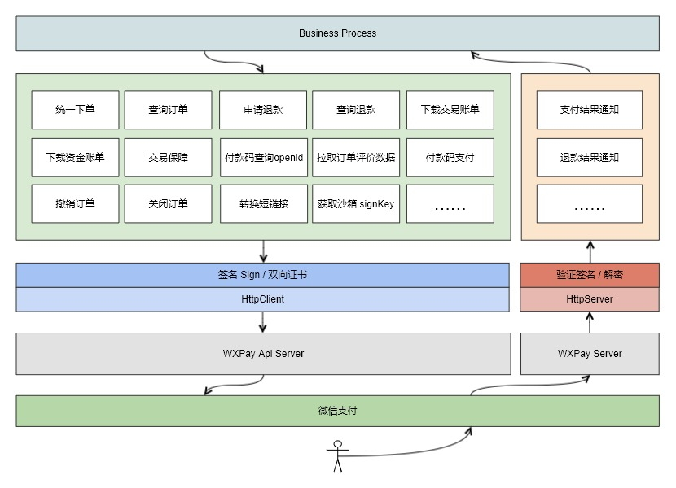

# fastwego/wxpay [beta]

A fast [wxpay(v2)](https://pay.weixin.qq.com/wiki/doc/api/index.html) development sdk written in Golang

## 快速开始 & demo

```shell script
go get github.com/fastwego/wxpay
```

```go
// 微信支付 实例
pay = wxpay.New(wxpay.Config{
    Appid:  "APPID",
    Mchid:  "MCHID",
    ApiKey: "APIKEY",
    //IsSandBoxMode: true,
    Cert: "CERT",
})

// 统一下单
params := map[string]string{
    "appid":            pay.Config.Appid,
    "mch_id":           pay.Config.Mchid,
    "nonce_str":        util.GetRandString(32),
    "body":             "BODY",
    "out_trade_no":     "NO.10086",
    "total_fee":        c.Request.URL.Query().Get("fee"), // 201
    "spbill_create_ip": "12.123.14.223",
    "notify_url":       viper.GetString("NOTIFYURL"),
    "trade_type":       types.TradeTypeAPP,
}
result, err := order.UnifiedOrder(pay, params)
fmt.Println(result, err)

if err != nil {
    return
}

// 返回客户端预下单信息
//result["prepay_id"]

```

完整演示项目：

[https://github.com/fastwego/wxpay-demo](https://github.com/fastwego/wxpay-demo)

查看所有支持的 [API 列表](./doc/apilist.md)

## 架构设计




## 框架特点

### 快速

「快」作为框架设计的核心理念，体现在方方面面：

- 使用 Go 语言，开发快、编译快、部署快、运行快，轻松服务海量用户
- 丰富的[文档](https://pkg.go.dev/github.com/fastwego/wxpay) 和 [演示代码](https://github.com/fastwego/wxpay-demo) ，快速上手
- 独立清晰的模块划分，快速熟悉整个框架，没有意外，一切都是你期望的样子
- 甚至连框架自身的大部分代码也是自动生成的，维护更新快到超乎想象

### 符合直觉

作为第三方开发框架，尽可能贴合官方文档和设计，不引入新的概念，不给开发者添加学习负担

### 官方文档就是最好的文档

每个接口的注释都附带官方文档的链接，让你随时翻阅，省时省心

### 完备的单元测试

100% 覆盖每一个接口，让你每一次调用都信心满满

### 活跃的开发者社区

FastWeGo 是一套完整的微信开发框架，包括公众号、开放平台、微信支付、企业微信、小程序、小游戏等微信服务，拥有庞大的开发者用户群体

你遇到的所有问题几乎都可以在社区找到解决方案

## 参与贡献

欢迎提交 pull request / issue / 文档，一起让微信开发更快更好！

Faster we go together!